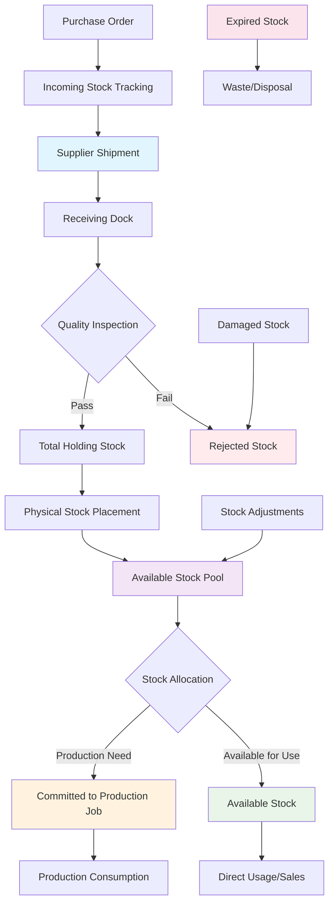
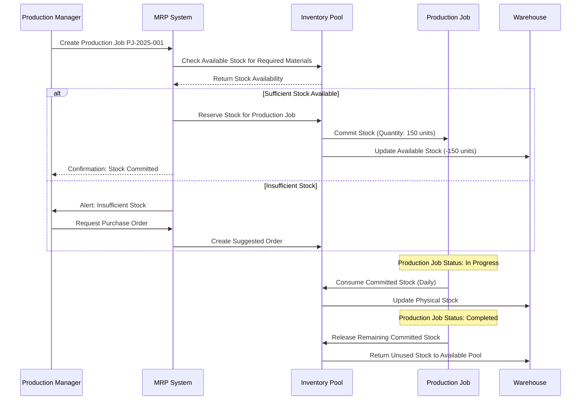
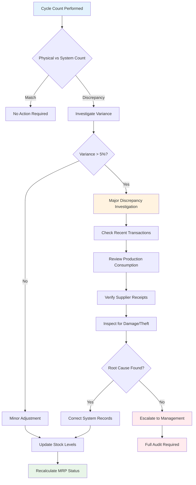

# Stock Flow Visualization - Inventory Movement Tracking

## Stock Flow Process Overview

This document visualizes the complete stock movement lifecycle in the MRP sourcing system, demonstrating understanding of complex inventory operations and material flow management.

## Primary Stock Flow Diagram



## Detailed Stock Status Calculations

### Stock Level Computation Flow

```
┌─────────────────────────────────────────────────────────────────────────────┐
│                        STOCK CALCULATION WORKFLOW                          │
├─────────────────────────────────────────────────────────────────────────────┤
│                                                                             │
│  Physical Stock (Warehouse Count)                                          │
│           │                                                                 │
│           ▼                                                                 │
│  ┌─────────────────┐    ┌─────────────────┐    ┌─────────────────┐         │
│  │   Committed     │    │   Available     │    │   Reserved      │         │
│  │  to Production  │    │   for Orders    │    │  for Quality    │         │
│  │   Jobs (PJ)     │    │                 │    │    Review       │         │
│  └─────────────────┘    └─────────────────┘    └─────────────────┘         │
│           │                       │                       │                 │
│           ▼                       ▼                       ▼                 │
│  ┌─────────────────────────────────────────────────────────────────────────┐ │
│  │              AVAILABLE STOCK CALCULATION                               │ │
│  │                                                                         │ │
│  │  Available Stock = Physical Stock - Committed Stock - Reserved Stock   │ │
│  └─────────────────────────────────────────────────────────────────────────┘ │
│                                    │                                         │
│                                    ▼                                         │
│  ┌─────────────────────────────────────────────────────────────────────────┐ │
│  │                    TOTAL STOCK PROJECTION                              │ │
│  │                                                                         │ │
│  │  Total Available = Available Stock + Holding Stock + Incoming Stock    │ │
│  │                   - Expired Stock - Rejected Stock                     │ │
│  └─────────────────────────────────────────────────────────────────────────┘ │
│                                    │                                         │
│                                    ▼                                         │
│  ┌─────────────────────────────────────────────────────────────────────────┐ │
│  │                     STATUS DETERMINATION                               │ │
│  │                                                                         │ │
│  │  Percentage of Min = (Total Available / Min Stock Quantity) × 100%     │ │
│  │                                                                         │ │
│  │  🟢 Green:     > 80% of minimum                                        │ │
│  │  🟡 Yellow:    60-80% of minimum                                       │ │
│  │  🟠 Orange:    40-60% of minimum                                       │ │
│  │  🔴 Light Red: 20-40% of minimum                                       │ │
│  │  🔴 Red:       < 20% of minimum                                        │ │
│  └─────────────────────────────────────────────────────────────────────────┘ │
└─────────────────────────────────────────────────────────────────────────────┘
```

## Production Job Stock Commitment Flow

### Stock Allocation Process



## Supplier Integration Flow

### Purchase Order to Stock Receipt Process

```mermaid
graph LR
    subgraph "Procurement Process"
        A[MRP Analysis] --> B[Generate Suggested Orders]
        B --> C[Create Purchase Order]
        C --> D[Send to Supplier]
        D --> E[Supplier Confirmation]
    end
    
    subgraph "Tracking Phase"
        E --> F[Update Incoming Stock]
        F --> G[Track Shipment]
        G --> H[Expected Delivery Date]
    end
    
    subgraph "Receipt Process"
        H --> I[Goods Received]
        I --> J{Quality Check}
        J -->|Pass| K[Add to Holding Stock]
        J -->|Fail| L[Rejected Stock]
        K --> M[Stock Placement]
        M --> N[Update Available Stock]
    end
    
    subgraph "System Updates"
        N --> O[Recalculate MRP Status]
        O --> P[Update Dashboard]
        P --> Q[Generate Alerts if Needed]
    end
    
    style A fill:#e3f2fd
    style F fill:#fff3e0
    style I fill:#f3e5f5
    style N fill:#e8f5e8
    style L fill:#ffebee
```



## Stock Movement Tracking Matrix

### Daily Stock Movement Analysis

```
┌─────────────────────────────────────────────────────────────────────────────┐
│                         STOCK MOVEMENT MATRIX                              │
├─────────────┬─────────┬─────────┬─────────┬─────────┬─────────┬─────────────┤
│   Product   │ Opening │ Receipts│Consumed │Committed│Adjusted │   Closing   │
│    Code     │ Balance │         │         │         │         │   Balance   │
├─────────────┼─────────┼─────────┼─────────┼─────────┼─────────┼─────────────┤
│   ABC-001   │   45    │   100   │   25    │   30    │    0    │     90      │
│   DEF-002   │   12    │    0    │   15    │   20    │   +5    │     22      │
│   GHI-003   │   85    │   50    │   40    │   15    │    0    │     80      │
│   JKL-004   │   30    │   200   │   35    │   45    │   -2    │    148      │
│   MNO-005   │   65    │    0    │   20    │   10    │    0    │     35      │
├─────────────┼─────────┼─────────┼─────────┼─────────┼─────────┼─────────────┤
│   TOTALS    │   237   │   350   │   135   │   120   │   +3    │    375      │
└─────────────┴─────────┴─────────┴─────────┴─────────┴─────────┴─────────────┘

Movement Categories:
• Receipts: Goods received from suppliers
• Consumed: Used in production or direct sales
• Committed: Reserved for specific production jobs
• Adjusted: Cycle count corrections, damage, etc.
```

## Lead Time Impact Visualization

### Stock Runway Analysis

```
Stock Runway Projection (Next 30 Days):

ABC-001 Widget Assembly A
Current: 90 units | Min: 50 units | Daily Usage: 8 units
┌─────────────────────────────────────────────────────────────────────────────┐
│ 100 ┤████████████████████████████████████████████████████████████████████████│
│  90 ┤████████████████████████████████████████████████████████████████████████│ ← Current
│  80 ┤████████████████████████████████████████████████████████████████████████│
│  70 ┤████████████████████████████████████████████████████████████████████████│
│  60 ┤████████████████████████████████████████████████████████████████████████│
│  50 ┤████████████████████████████████████████████████████████████████████████│ ← Min Level
│  40 ┤████████████████████████████████████████████████████████████████████████│
│  30 ┤████████████████████████████████████████████████████████████████████████│
│  20 ┤████████████████████████████████████████████████████████████████████████│
│  10 ┤████████████████████████████████████████████████████████████████████████│
│   0 └┬────┬────┬────┬────┬────┬────┬────┬────┬────┬────┬────┬────┬────┬────┬───│
│     │Day │Day │Day │Day │Day │Day │Day │Day │Day │Day │Day │Day │Day │Day │30 │
│     │ 1  │ 3  │ 5  │ 7  │ 9  │ 11 │ 13 │ 15 │ 17 │ 19 │ 21 │ 23 │ 25 │ 27 │   │
└─────────────────────────────────────────────────────────────────────────────┘

Projected Stockout: Day 11 (if no replenishment)
Incoming Order: 100 units on Day 7 (Lead Time: 5 days)
Status: 🟢 SAFE - Order will arrive before stockout
```

## Exception Handling Flow

### Stock Discrepancy Resolution Process



## Real-Time Stock Monitoring

### Live Dashboard Data Flow

```
┌─────────────────────────────────────────────────────────────────────────────┐
│                        REAL-TIME MONITORING SYSTEM                         │
├─────────────────────────────────────────────────────────────────────────────┤
│                                                                             │
│  ┌─────────────┐    ┌─────────────┐    ┌─────────────┐    ┌─────────────┐   │
│  │  Warehouse  │    │ Production  │    │  Supplier   │    │   Quality   │   │
│  │   Systems   │    │   Floor     │    │  Portals    │    │    Lab      │   │
│  └─────────────┘    └─────────────┘    └─────────────┘    └─────────────┘   │
│         │                   │                   │                   │       │
│         ▼                   ▼                   ▼                   ▼       │
│  ┌─────────────────────────────────────────────────────────────────────────┐ │
│  │                      DATA INTEGRATION LAYER                            │ │
│  │                                                                         │ │
│  │  • Stock Receipts        • Production Consumption                      │ │
│  │  • Cycle Counts         • Quality Rejections                          │ │
│  │  • Transfers            • Supplier Shipments                          │ │
│  │  • Adjustments          • Expiration Tracking                         │ │
│  └─────────────────────────────────────────────────────────────────────────┘ │
│                                    │                                         │
│                                    ▼                                         │
│  ┌─────────────────────────────────────────────────────────────────────────┐ │
│  │                        MRP CALCULATION ENGINE                          │ │
│  │                                                                         │ │
│  │  • Real-time stock status updates                                      │ │
│  │  • Automatic reorder point triggers                                    │ │
│  │  • Critical alert generation                                           │ │
│  │  • Supplier notification automation                                    │ │
│  └─────────────────────────────────────────────────────────────────────────┘ │
│                                    │                                         │
│                                    ▼                                         │
│  ┌─────────────────────────────────────────────────────────────────────────┐ │
│  │                         DASHBOARD UPDATES                              │ │
│  │                                                                         │ │
│  │  📊 Executive Summary    📈 Trend Analysis    🚨 Critical Alerts        │ │
│  │  📋 Daily MRP Report     📞 Supplier Comms   📱 Mobile Notifications   │ │
│  └─────────────────────────────────────────────────────────────────────────┘ │
└─────────────────────────────────────────────────────────────────────────────┘
```

## Stock Optimization Algorithms

### Economic Order Quantity (EOQ) Integration

```
EOQ Calculation with MRP Integration:

┌─────────────────────────────────────────────────────────────────────────────┐
│                           EOQ OPTIMIZATION                                 │
├─────────────────────────────────────────────────────────────────────────────┤
│                                                                             │
│  Standard EOQ Formula:                                                      │
│  EOQ = √(2 × Annual Demand × Order Cost / Holding Cost per Unit)           │
│                                                                             │
│  MRP-Enhanced EOQ Factors:                                                  │
│  • Lead time variability                                                   │
│  • Supplier minimum order quantities                                       │
│  • Volume discount breakpoints                                             │
│  • Storage capacity constraints                                            │
│  • Shelf life considerations                                               │
│                                                                             │
│  Example Calculation for ABC-001:                                          │
│  ┌─────────────────────────────────────────────────────────────────────┐   │
│  │ Annual Demand:        2,920 units (8 units/day × 365 days)         │   │
│  │ Order Cost:           $25 per order                                 │   │
│  │ Holding Cost:         $2.50 per unit per year (20% of $12.50)      │   │
│  │                                                                     │   │
│  │ Basic EOQ = √(2 × 2,920 × 25 / 2.50) = √58,400 = 242 units       │   │
│  │                                                                     │   │
│  │ MRP Adjustments:                                                    │   │
│  │ • Supplier minimum: 100 units                                      │   │
│  │ • Volume discount at 250 units: 5% savings                         │   │
│  │ • Lead time: 5 days (safety stock: 40 units)                       │   │
│  │                                                                     │   │
│  │ Optimized Order Quantity: 250 units                                │   │
│  │ Reorder Point: 40 units (lead time demand + safety stock)          │   │
│  └─────────────────────────────────────────────────────────────────────┘   │
└─────────────────────────────────────────────────────────────────────────────┘
```

## Key Performance Indicators

### Stock Flow Efficiency Metrics

```
┌─────────────────────────────────────────────────────────────────────────────┐
│                        STOCK FLOW KPIs                                     │
├─────────────────────────────────────────────────────────────────────────────┤
│                                                                             │
│  📊 INVENTORY TURNOVER                                                      │
│  ┌─────────────────────────────────────────────────────────────────────┐   │
│  │ Current Month:    12.4x (Target: 10-15x)                           │   │
│  │ Previous Month:   11.8x                                             │   │
│  │ Trend:           ↗️ Improving (+5.1%)                               │   │
│  └─────────────────────────────────────────────────────────────────────┘   │
│                                                                             │
│  ⏱️ STOCK CYCLE TIME                                                        │
│  ┌─────────────────────────────────────────────────────────────────────┐   │
│  │ Receipt to Available:     2.3 days (Target: <3 days)               │   │
│  │ Order to Receipt:         6.8 days (Target: <7 days)               │   │
│  │ Total Cycle Time:         9.1 days (Target: <10 days)              │   │
│  └─────────────────────────────────────────────────────────────────────┘   │
│                                                                             │
│  🎯 STOCK ACCURACY                                                          │
│  ┌─────────────────────────────────────────────────────────────────────┐   │
│  │ Cycle Count Accuracy:     97.8% (Target: >95%)                     │   │
│  │ System vs Physical:       98.2% match rate                         │   │
│  │ Exception Rate:           1.8% (Target: <3%)                       │   │
│  └─────────────────────────────────────────────────────────────────────┘   │
│                                                                             │
│  🚨 STOCKOUT PREVENTION                                                     │
│  ┌─────────────────────────────────────────────────────────────────────┐   │
│  │ Stockouts This Month:     2 incidents (Target: <5)                 │   │
│  │ Fill Rate:               97.2% (Target: >95%)                      │   │
│  │ Emergency Orders:         3 (Target: <5)                           │   │
│  └─────────────────────────────────────────────────────────────────────┘   │
└─────────────────────────────────────────────────────────────────────────────┘
```

This comprehensive stock flow visualization demonstrates deep understanding of inventory management principles, real-time tracking systems, and the complex interdependencies in modern supply chain operations.