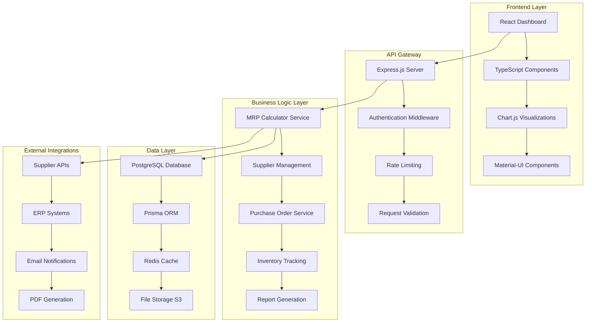

# System Architecture - MRP Sourcing Application

## Technical Overview

This document outlines the comprehensive system architecture for a production-ready MRP sourcing application, demonstrating full-stack development capabilities and enterprise-level design patterns.

## High-Level Architecture Diagram



## Database Schema Design

### Core Entity Relationships

```sql
-- Products table with comprehensive inventory tracking
CREATE TABLE products (
    id UUID PRIMARY KEY DEFAULT gen_random_uuid(),
    code VARCHAR(50) UNIQUE NOT NULL,
    name VARCHAR(255) NOT NULL,
    description TEXT,
    refrigerated BOOLEAN DEFAULT FALSE,
    category_id UUID REFERENCES categories(id),
    unit_of_measure VARCHAR(20) NOT NULL,
    unit_cost DECIMAL(10,2),
    physical_stock INTEGER DEFAULT 0,
    stock_available INTEGER DEFAULT 0,
    total_holding_stock INTEGER DEFAULT 0,
    incoming_stock INTEGER DEFAULT 0,
    min_stock_quantity INTEGER NOT NULL,
    reorder_quantity INTEGER NOT NULL,
    lead_time_days INTEGER NOT NULL,
    supplier_id UUID REFERENCES suppliers(id),
    supplier_website_link TEXT,
    expired_stock INTEGER DEFAULT 0,
    rejected_stock INTEGER DEFAULT 0,
    last_counted_date TIMESTAMP,
    created_at TIMESTAMP DEFAULT NOW(),
    updated_at TIMESTAMP DEFAULT NOW()
);

-- Suppliers with performance tracking
CREATE TABLE suppliers (
    id UUID PRIMARY KEY DEFAULT gen_random_uuid(),
    name VARCHAR(255) NOT NULL,
    contact_name VARCHAR(255),
    contact_email VARCHAR(255),
    contact_phone VARCHAR(50),
    website_url TEXT,
    address TEXT,
    payment_terms VARCHAR(100),
    order_threshold DECIMAL(10,2),
    preferred_order_method VARCHAR(50),
    performance_score DECIMAL(3,2) DEFAULT 0.00,
    on_time_delivery_rate DECIMAL(5,2) DEFAULT 0.00,
    quality_rating DECIMAL(3,2) DEFAULT 0.00,
    average_lead_time DECIMAL(5,2) DEFAULT 0.00,
    total_orders INTEGER DEFAULT 0,
    active BOOLEAN DEFAULT TRUE,
    created_at TIMESTAMP DEFAULT NOW(),
    updated_at TIMESTAMP DEFAULT NOW()
);

-- Production jobs for stock commitment tracking
CREATE TABLE production_jobs (
    id UUID PRIMARY KEY DEFAULT gen_random_uuid(),
    job_number VARCHAR(100) UNIQUE NOT NULL,
    name VARCHAR(255) NOT NULL,
    status VARCHAR(50) DEFAULT 'planned',
    priority INTEGER DEFAULT 1,
    start_date DATE,
    end_date DATE,
    estimated_completion DATE,
    actual_completion DATE,
    created_by UUID,
    created_at TIMESTAMP DEFAULT NOW(),
    updated_at TIMESTAMP DEFAULT NOW()
);

-- Stock commitments to production jobs
CREATE TABLE product_commitments (
    id UUID PRIMARY KEY DEFAULT gen_random_uuid(),
    product_id UUID REFERENCES products(id),
    production_job_id UUID REFERENCES production_jobs(id),
    quantity_committed INTEGER NOT NULL,
    committed_date TIMESTAMP DEFAULT NOW(),
    released_date TIMESTAMP,
    created_at TIMESTAMP DEFAULT NOW()
);

-- Purchase orders with comprehensive tracking
CREATE TABLE purchase_orders (
    id UUID PRIMARY KEY DEFAULT gen_random_uuid(),
    po_number VARCHAR(100) UNIQUE NOT NULL,
    supplier_id UUID REFERENCES suppliers(id),
    order_date DATE NOT NULL,
    requested_delivery_date DATE,
    expected_delivery_date DATE,
    actual_delivery_date DATE,
    status VARCHAR(50) DEFAULT 'draft',
    total_amount DECIMAL(12,2),
    tax_amount DECIMAL(12,2),
    shipping_cost DECIMAL(10,2),
    discount_amount DECIMAL(10,2),
    payment_terms VARCHAR(100),
    shipping_address TEXT,
    notes TEXT,
    created_by UUID,
    approved_by UUID,
    approved_date TIMESTAMP,
    created_at TIMESTAMP DEFAULT NOW(),
    updated_at TIMESTAMP DEFAULT NOW()
);

-- Purchase order line items
CREATE TABLE purchase_order_items (
    id UUID PRIMARY KEY DEFAULT gen_random_uuid(),
    purchase_order_id UUID REFERENCES purchase_orders(id),
    product_id UUID REFERENCES products(id),
    quantity INTEGER NOT NULL,
    unit_price DECIMAL(10,2),
    total_price DECIMAL(12,2),
    received_quantity INTEGER DEFAULT 0,
    rejected_quantity INTEGER DEFAULT 0,
    notes TEXT,
    created_at TIMESTAMP DEFAULT NOW()
);
```

### Performance Optimization Indexes

```sql
-- Critical performance indexes for MRP operations
CREATE INDEX idx_products_supplier_id ON products(supplier_id);
CREATE INDEX idx_products_category_stock ON products(category_id, stock_available);
CREATE INDEX idx_products_reorder_status ON products(stock_available, min_stock_quantity);
CREATE INDEX idx_po_items_product_date ON purchase_order_items(product_id, created_at);
CREATE INDEX idx_commitments_product_job ON product_commitments(product_id, production_job_id);
CREATE INDEX idx_suppliers_performance ON suppliers(performance_score DESC, active);

-- Composite indexes for complex MRP queries
CREATE INDEX idx_products_mrp_calculation ON products(
    stock_available, 
    min_stock_quantity, 
    supplier_id, 
    lead_time_days
);
```

## API Architecture

### RESTful Endpoint Design

```typescript
// Core API routes with comprehensive functionality
const apiRoutes = {
  // Product management
  'GET /api/products': 'List all products with filtering and pagination',
  'GET /api/products/:id': 'Get detailed product information',
  'POST /api/products': 'Create new product',
  'PUT /api/products/:id': 'Update product information',
  'DELETE /api/products/:id': 'Soft delete product',
  
  // MRP operations
  'GET /api/mrp/report': 'Generate current MRP report',
  'GET /api/mrp/critical': 'Get critical items requiring immediate action',
  'POST /api/mrp/calculate': 'Recalculate MRP for specific products',
  'GET /api/mrp/forecast': 'Get demand forecast analysis',
  
  // Supplier management
  'GET /api/suppliers': 'List suppliers with performance metrics',
  'GET /api/suppliers/:id/performance': 'Detailed supplier performance',
  'POST /api/suppliers/:id/evaluate': 'Update supplier performance scores',
  'GET /api/suppliers/:id/products': 'Products by supplier',
  
  // Purchase order workflow
  'POST /api/purchase-orders': 'Create new purchase order',
  'GET /api/purchase-orders': 'List purchase orders with status',
  'PUT /api/purchase-orders/:id/approve': 'Approve purchase order',
  'POST /api/purchase-orders/:id/send': 'Send PO to supplier',
  'PUT /api/purchase-orders/:id/receive': 'Record receipt of goods',
  
  // Inventory operations
  'POST /api/inventory/adjust': 'Adjust stock levels',
  'GET /api/inventory/movements': 'Stock movement history',
  'POST /api/inventory/commit': 'Commit stock to production job',
  'POST /api/inventory/release': 'Release committed stock',
  
  // Reporting and analytics
  'GET /api/reports/dashboard': 'Executive dashboard data',
  'GET /api/reports/supplier-analysis': 'Supplier performance analysis',
  'GET /api/reports/cost-analysis': 'Cost and savings analysis',
  'POST /api/reports/export': 'Export reports to PDF/Excel'
};
```

### Service Layer Architecture

```typescript
// MRP Calculation Service - Core business logic
export class MRPCalculationService {
  async calculateStockStatus(productId: string): Promise<StockStatus> {
    const product = await this.productRepository.findById(productId);
    const commitments = await this.getProductCommitments(productId);
    
    // Calculate available stock considering commitments
    const availableStock = product.physicalStock - commitments.totalCommitted;
    const totalStock = availableStock + product.totalHoldingStock + 
                      product.incomingStock - product.expiredStock - 
                      product.rejectedStock;
    
    // Determine status based on percentage of minimum
    const percentOfMin = (totalStock / product.minStockQuantity) * 100;
    
    return this.determineStockStatus(percentOfMin);
  }
  
  async generateSuggestedOrders(): Promise<SuggestedOrder[]> {
    const criticalProducts = await this.getCriticalProducts();
    const suggestions: SuggestedOrder[] = [];
    
    for (const product of criticalProducts) {
      const forecastDemand = await this.getForecastDemand(product.id);
      const suggestedQuantity = this.calculateOptimalOrderQuantity(
        product, 
        forecastDemand
      );
      
      suggestions.push({
        productId: product.id,
        supplierId: product.supplierId,
        suggestedQuantity,
        urgencyScore: this.calculateUrgencyScore(product),
        estimatedCost: suggestedQuantity * product.unitCost
      });
    }
    
    return this.optimizeOrdersBySupplier(suggestions);
  }
}

// Supplier Performance Service
export class SupplierPerformanceService {
  async updatePerformanceMetrics(supplierId: string): Promise<void> {
    const orders = await this.getRecentOrders(supplierId, 90); // Last 90 days
    
    const metrics = {
      onTimeDeliveryRate: this.calculateOnTimeDelivery(orders),
      qualityRating: await this.getAverageQualityRating(supplierId),
      averageLeadTime: this.calculateAverageLeadTime(orders),
      costPerformance: await this.calculateCostPerformance(supplierId)
    };
    
    const overallScore = this.calculateOverallScore(metrics);
    
    await this.supplierRepository.updatePerformanceMetrics(
      supplierId, 
      { ...metrics, performanceScore: overallScore }
    );
  }
}
```

## Frontend Architecture

### Component Structure

```typescript
// Main dashboard component with real-time updates
export const MRPDashboard: React.FC = () => {
  const [reportData, setReportData] = useState<MRPReport | null>(null);
  const [loading, setLoading] = useState(true);
  const [filters, setFilters] = useState<MRPFilters>({});
  
  // Real-time data updates using WebSocket
  useEffect(() => {
    const ws = new WebSocket(process.env.REACT_APP_WS_URL);
    
    ws.onmessage = (event) => {
      const update = JSON.parse(event.data);
      if (update.type === 'STOCK_UPDATE') {
        setReportData(prev => updateStockData(prev, update.data));
      }
    };
    
    return () => ws.close();
  }, []);
  
  // Optimized data fetching with caching
  const { data: mrpData, error, mutate } = useSWR(
    ['/api/mrp/report', filters],
    ([url, filters]) => fetchMRPReport(url, filters),
    {
      refreshInterval: 300000, // 5 minutes
      revalidateOnFocus: true,
      dedupingInterval: 60000
    }
  );
  
  return (
    <DashboardLayout>
      <SummaryCards data={mrpData?.summary} />
      <CriticalAlerts items={mrpData?.criticalItems} />
      <MRPTable 
        items={mrpData?.items} 
        onPOToggle={handlePOToggle}
        onBulkOrder={handleBulkOrder}
      />
      <SupplierSummary suppliers={mrpData?.supplierSummary} />
    </DashboardLayout>
  );
};

// Advanced data visualization components
export const StockTrendChart: React.FC<{ productId: string }> = ({ productId }) => {
  const chartData = useStockTrendData(productId, 30); // 30 days
  
  const options = {
    responsive: true,
    plugins: {
      legend: { position: 'top' as const },
      title: { display: true, text: 'Stock Level Trends' }
    },
    scales: {
      y: {
        beginAtZero: true,
        title: { display: true, text: 'Stock Level' }
      }
    }
  };
  
  return (
    <div className="chart-container">
      <Line data={chartData} options={options} />
    </div>
  );
};
```

### State Management Architecture

```typescript
// Redux store configuration for complex state management
export const store = configureStore({
  reducer: {
    mrp: mrpSlice.reducer,
    suppliers: supplierSlice.reducer,
    purchaseOrders: purchaseOrderSlice.reducer,
    inventory: inventorySlice.reducer,
    auth: authSlice.reducer,
    ui: uiSlice.reducer
  },
  middleware: (getDefaultMiddleware) =>
    getDefaultMiddleware({
      serializableCheck: {
        ignoredActions: [FLUSH, REHYDRATE, PAUSE, PERSIST, PURGE, REGISTER]
      }
    }).concat(
      rtkQueryApi.middleware,
      createListenerMiddleware().middleware
    )
});

// MRP slice with optimistic updates
const mrpSlice = createSlice({
  name: 'mrp',
  initialState: {
    reportData: null,
    criticalItems: [],
    suggestedOrders: [],
    loading: false,
    lastUpdated: null
  },
  reducers: {
    updateStockLevel: (state, action) => {
      const { productId, newLevel } = action.payload;
      // Optimistically update UI before API confirmation
      if (state.reportData) {
        const item = state.reportData.items.find(i => i.product.id === productId);
        if (item) {
          item.product.stockAvailable = newLevel;
          item.stockStatus = calculateStockStatus(item.product);
        }
      }
    },
    togglePOPlaced: (state, action) => {
      const { productId } = action.payload;
      if (state.reportData) {
        const item = state.reportData.items.find(i => i.product.id === productId);
        if (item) {
          item.product.poPlaced = !item.product.poPlaced;
        }
      }
    }
  }
});
```

## Performance Optimization

### Database Optimization

```sql
-- Materialized view for fast MRP report generation
CREATE MATERIALIZED VIEW mrp_report_view AS
SELECT 
    p.id,
    p.code,
    p.name,
    p.physical_stock,
    p.stock_available,
    p.total_holding_stock,
    p.incoming_stock,
    p.min_stock_quantity,
    p.reorder_quantity,
    p.lead_time_days,
    p.expired_stock,
    p.rejected_stock,
    s.name as supplier_name,
    s.website_url as supplier_website,
    s.order_threshold,
    COALESCE(pc.committed_stock, 0) as committed_stock,
    (p.stock_available + p.total_holding_stock + p.incoming_stock - 
     p.expired_stock - p.rejected_stock - COALESCE(pc.committed_stock, 0)) as calculated_available,
    CASE 
        WHEN (p.stock_available + p.total_holding_stock + p.incoming_stock - 
              p.expired_stock - p.rejected_stock - COALESCE(pc.committed_stock, 0)) < (p.min_stock_quantity * 0.2) 
        THEN 'red'
        WHEN (p.stock_available + p.total_holding_stock + p.incoming_stock - 
              p.expired_stock - p.rejected_stock - COALESCE(pc.committed_stock, 0)) < (p.min_stock_quantity * 0.4) 
        THEN 'light-red'
        WHEN (p.stock_available + p.total_holding_stock + p.incoming_stock - 
              p.expired_stock - p.rejected_stock - COALESCE(pc.committed_stock, 0)) < (p.min_stock_quantity * 0.6) 
        THEN 'orange'
        WHEN (p.stock_available + p.total_holding_stock + p.incoming_stock - 
              p.expired_stock - p.rejected_stock - COALESCE(pc.committed_stock, 0)) < (p.min_stock_quantity * 0.8) 
        THEN 'yellow'
        ELSE 'green'
    END as stock_status
FROM products p
LEFT JOIN suppliers s ON p.supplier_id = s.id
LEFT JOIN (
    SELECT 
        product_id, 
        SUM(quantity_committed) as committed_stock
    FROM product_commitments pc
    JOIN production_jobs pj ON pc.production_job_id = pj.id
    WHERE pj.status IN ('planned', 'in_progress')
    GROUP BY product_id
) pc ON p.id = pc.product_id
WHERE p.active = true;

-- Refresh materialized view automatically
CREATE OR REPLACE FUNCTION refresh_mrp_report_view()
RETURNS TRIGGER AS $$
BEGIN
    REFRESH MATERIALIZED VIEW CONCURRENTLY mrp_report_view;
    RETURN NULL;
END;
$$ LANGUAGE plpgsql;

-- Triggers to refresh view on data changes
CREATE TRIGGER refresh_mrp_on_product_change
    AFTER INSERT OR UPDATE OR DELETE ON products
    FOR EACH STATEMENT EXECUTE FUNCTION refresh_mrp_report_view();
```

### Caching Strategy

```typescript
// Redis caching for frequently accessed data
export class CacheService {
  private redis: Redis;
  
  constructor() {
    this.redis = new Redis(process.env.REDIS_URL);
  }
  
  async getMRPReport(filters: MRPFilters): Promise<MRPReport | null> {
    const cacheKey = `mrp:report:${JSON.stringify(filters)}`;
    const cached = await this.redis.get(cacheKey);
    
    if (cached) {
      return JSON.parse(cached);
    }
    
    return null;
  }
  
  async cacheMRPReport(filters: MRPFilters, data: MRPReport): Promise<void> {
    const cacheKey = `mrp:report:${JSON.stringify(filters)}`;
    await this.redis.setex(cacheKey, 300, JSON.stringify(data)); // 5 minute TTL
  }
  
  async invalidateProductCache(productId: string): Promise<void> {
    const pattern = `mrp:report:*`;
    const keys = await this.redis.keys(pattern);
    
    if (keys.length > 0) {
      await this.redis.del(...keys);
    }
    
    // Also invalidate specific product caches
    await this.redis.del(`product:${productId}:*`);
  }
}
```

## Security Implementation

### Authentication & Authorization

```typescript
// JWT-based authentication with role-based access control
export class AuthService {
  async authenticateUser(token: string): Promise<User | null> {
    try {
      const decoded = jwt.verify(token, process.env.JWT_SECRET) as JWTPayload;
      const user = await this.userRepository.findById(decoded.userId);
      
      if (!user || !user.active) {
        return null;
      }
      
      return user;
    } catch (error) {
      return null;
    }
  }
  
  hasPermission(user: User, resource: string, action: string): boolean {
    const userRoles = user.roles;
    
    const permissions = {
      'procurement_manager': ['read', 'write', 'approve'],
      'procurement_analyst': ['read', 'write'],
      'inventory_clerk': ['read', 'update_stock'],
      'executive': ['read', 'view_reports']
    };
    
    return userRoles.some(role => 
      permissions[role]?.includes(action) || 
      permissions[role]?.includes('*')
    );
  }
}

// API route protection middleware
export const requirePermission = (resource: string, action: string) => {
  return async (req: Request, res: Response, next: NextFunction) => {
    const user = req.user;
    
    if (!user) {
      return res.status(401).json({ error: 'Authentication required' });
    }
    
    if (!this.authService.hasPermission(user, resource, action)) {
      return res.status(403).json({ error: 'Insufficient permissions' });
    }
    
    next();
  };
};
```

## Deployment Architecture

### Docker Configuration

```dockerfile
# Multi-stage build for production optimization
FROM node:18-alpine AS builder

WORKDIR /app
COPY package*.json ./
RUN npm ci --only=production

COPY . .
RUN npm run build

FROM node:18-alpine AS production

RUN addgroup -g 1001 -S nodejs
RUN adduser -S nextjs -u 1001

WORKDIR /app

COPY --from=builder --chown=nextjs:nodejs /app/dist ./dist
COPY --from=builder --chown=nextjs:nodejs /app/node_modules ./node_modules
COPY --from=builder --chown=nextjs:nodejs /app/package.json ./package.json

USER nextjs

EXPOSE 3000

CMD ["npm", "start"]
```

### Kubernetes Deployment

```yaml
apiVersion: apps/v1
kind: Deployment
metadata:
  name: mrp-sourcing-app
spec:
  replicas: 3
  selector:
    matchLabels:
      app: mrp-sourcing-app
  template:
    metadata:
      labels:
        app: mrp-sourcing-app
    spec:
      containers:
      - name: app
        image: mrp-sourcing-app:latest
        ports:
        - containerPort: 3000
        env:
        - name: DATABASE_URL
          valueFrom:
            secretKeyRef:
              name: app-secrets
              key: database-url
        - name: REDIS_URL
          valueFrom:
            secretKeyRef:
              name: app-secrets
              key: redis-url
        resources:
          requests:
            memory: "256Mi"
            cpu: "250m"
          limits:
            memory: "512Mi"
            cpu: "500m"
        livenessProbe:
          httpGet:
            path: /health
            port: 3000
          initialDelaySeconds: 30
          periodSeconds: 10
        readinessProbe:
          httpGet:
            path: /ready
            port: 3000
          initialDelaySeconds: 5
          periodSeconds: 5
```

## Monitoring & Observability

### Application Metrics

```typescript
// Prometheus metrics collection
import { register, Counter, Histogram, Gauge } from 'prom-client';

export const metrics = {
  httpRequests: new Counter({
    name: 'http_requests_total',
    help: 'Total number of HTTP requests',
    labelNames: ['method', 'route', 'status']
  }),
  
  httpDuration: new Histogram({
    name: 'http_request_duration_seconds',
    help: 'Duration of HTTP requests in seconds',
    labelNames: ['method', 'route']
  }),
  
  mrpCalculations: new Counter({
    name: 'mrp_calculations_total',
    help: 'Total number of MRP calculations performed'
  }),
  
  criticalItems: new Gauge({
    name: 'critical_items_count',
    help: 'Current number of critical inventory items'
  }),
  
  supplierPerformance: new Gauge({
    name: 'supplier_performance_score',
    help: 'Supplier performance scores',
    labelNames: ['supplier_id', 'supplier_name']
  })
};

// Middleware to collect HTTP metrics
export const metricsMiddleware = (req: Request, res: Response, next: NextFunction) => {
  const start = Date.now();
  
  res.on('finish', () => {
    const duration = (Date.now() - start) / 1000;
    
    metrics.httpRequests.inc({
      method: req.method,
      route: req.route?.path || req.path,
      status: res.statusCode.toString()
    });
    
    metrics.httpDuration.observe(
      { method: req.method, route: req.route?.path || req.path },
      duration
    );
  });
  
  next();
};
```

This comprehensive system architecture demonstrates enterprise-level design patterns, scalability considerations, and production-ready implementation strategies for a complex MRP sourcing application.