# MRP Sourcing System - Core Functionality Specification

## Product Overview

The MRP Sourcing System is a comprehensive procurement management platform designed to streamline daily sourcing operations, automate inventory monitoring, and optimize supplier relationships. This document defines the core functionality based on real-world procurement operations.

## Executive Summary

### Problem Statement
Procurement teams spend significant time manually tracking inventory levels, calculating reorder requirements, and managing supplier relationships across multiple systems. The lack of real-time visibility and automated decision support leads to stockouts, excess inventory, and inefficient purchasing decisions.

### Solution Overview
An integrated MRP sourcing platform that provides real-time inventory visibility, automated reorder calculations, and streamlined supplier management to optimize procurement operations and reduce manual effort.

### Key Success Metrics
- **Operational Efficiency**: 70% reduction in daily report generation time
- **Inventory Optimization**: 95%+ fill rate with 15% reduction in carrying costs
- **Supplier Performance**: 90%+ on-time delivery rate across supplier base
- **Process Automation**: 80% of routine purchase orders automated

## Core User Personas

### Primary User: Procurement Analyst
**Role**: Daily MRP management and supplier coordination
**Goals**: 
- Generate accurate daily MRP reports
- Identify critical stock situations quickly
- Optimize supplier orders for cost efficiency
- Maintain production continuity

**Pain Points**:
- Manual data compilation from multiple systems
- Difficulty prioritizing urgent vs. routine orders
- Lack of supplier performance visibility
- Time-consuming PO creation process

### Secondary User: Procurement Manager
**Role**: Strategic oversight and supplier relationship management
**Goals**:
- Monitor overall procurement performance
- Identify cost optimization opportunities
- Manage supplier relationships and contracts
- Ensure compliance with procurement policies

## Core Functionality Requirements

## 1. Daily MRP Report Generation

### 1.1 Core Data Schema

The system must capture and display the following data points for each product:

```
Core Product Attributes:
├── Product Code (Unique Identifier)
├── Product Name (Descriptive Name)
├── Refrigerated Flag (Boolean - Special Handling Required)
├── Category/Classification
└── Unit of Measure

Stock Level Tracking:
├── Physical Stock (Actual warehouse count)
├── Stock Available (Physical - Committed to Production Jobs)
├── Total Holding Stock (Received but not placed in location)
├── Incoming Stock (Ordered but not yet received)
├── Expired Stock (Past expiration date)
└── Rejected Stock (Failed quality inspection)

Procurement Parameters:
├── Min Stock Quantity (Reorder trigger point)
├── Reorder Quantity (Standard order amount)
├── Lead Time (Days from order to receipt)
├── Supplier ID (Primary supplier reference)
└── Supplier Website Link (Direct ordering portal)

Calculated Fields:
├── Available Stock Calculation
├── Suggested Order Quantity
├── Percentage of Minimum
├── Stock Status (Color-coded)
└── Days Until Stockout
```

### 1.2 Stock Status Calculation Logic

```mermaid
flowchart TD
    A[Physical Stock] --> B[Subtract: Committed to Production Jobs]
    B --> C[Stock Available]
    
    C --> D[Add: Total Holding Stock]
    D --> E[Add: Incoming Stock]
    E --> F[Subtract: Expired Stock]
    F --> G[Subtract: Rejected Stock]
    G --> H[Total Available Stock]
    
    H --> I[Calculate: Total Available / Min Stock Quantity]
    I --> J{Percentage of Minimum}
    
    J -->|> 80%| K[🟢 Green - Healthy]
    J -->|60-80%| L[🟡 Yellow - Monitor]
    J -->|40-60%| M[🟠 Orange - Caution]
    J -->|20-40%| N[🔴 Light Red - Order Soon]
    J -->|< 20%| O[🔴 Red - Critical - Order Now]
    
    style K fill:#4caf50,color:#fff
    style L fill:#ffeb3b,color:#000
    style M fill:#ff9800,color:#fff
    style N fill:#f44336,color:#fff
    style O fill:#d32f2f,color:#fff
```



### 1.3 Daily Report Structure

The daily MRP report must present information in a tabular format optimized for procurement decision-making:

```
┌─────────┬──────────────┬─────┬─────┬─────┬─────┬─────┬─────┬─────────┬─────┬────┬─────┬────┐
│  Code   │ Product Name │Phys │Avail│Hold │ Inc │Lead │ Min │Supplier │Sugg │ PO │ %  │Stat│
├─────────┼──────────────┼─────┼─────┼─────┼─────┼─────┼─────┼─────────┼─────┼────┼─────┼────┤
│ ABC-001 │ Widget A     │ 50  │ 45  │ 10  │ 20  │ 5d  │ 30  │ Supp A  │ 100 │ ☐  │250% │ 🟢 │
│ DEF-002 │ Component B  │ 15  │ 12  │  0  │  0  │ 7d  │ 25  │ Supp B  │  50 │ ☐  │ 48% │ 🟠 │
│ GHI-003 │ Part C       │  5  │  3  │  0  │  0  │ 3d  │ 40  │ Supp C  │ 100 │ ☐  │  8% │ 🔴 │
└─────────┴──────────────┴─────┴─────┴─────┴─────┴─────┴─────┴─────────┴─────┴────┴─────┴────┘

Column Definitions:
• Phys = Physical Stock Count
• Avail = Available Stock (not committed to production)
• Hold = Total Holding Stock (received but not placed)
• Inc = Incoming Stock (ordered but not received)
• Lead = Lead Time in days
• Min = Minimum Stock Quantity threshold
• Sugg = Suggested Order Quantity
• PO = Purchase Order Placed checkbox
• % = Percentage of Minimum Stock Level
• Stat = Color-coded Status Indicator
```

## 2. Production Job Integration

### 2.1 Stock Commitment Tracking

The system must track stock commitments to production jobs to accurately calculate available inventory:


### 2.2 Stock Commitment Business Rules

**Commitment Priority**:
1. Confirmed production jobs (highest priority)
2. Planned production jobs (medium priority)
3. Forecasted demand (lowest priority)

**Stock Release Rules**:
- Unused committed stock automatically returns to available pool upon job completion
- Partial releases allowed for job modifications
- Emergency releases require manager approval

## 3. Supplier Management & Bulk Ordering

### 3.1 Supplier Consolidation Logic

The system must optimize orders by supplier to achieve cost efficiencies:


### 3.2 Supplier Data Requirements

```
Supplier Master Data:
├── Supplier ID (Unique identifier)
├── Supplier Name
├── Contact Information
│   ├── Primary Contact Name
│   ├── Email Address
│   └── Phone Number
├── Ordering Information
│   ├── Website URL (Direct ordering portal)
│   ├── Order Threshold (Minimum order value)
│   ├── Payment Terms
│   └── Preferred Order Method
└── Performance Metrics
    ├── On-Time Delivery Rate
    ├── Quality Rating
    ├── Average Lead Time
    └── Cost Performance
```

## 4. Purchase Order Workflow

### 4.1 PO Generation Process


### 4.2 PO Placement Tracking

The system must provide a simple mechanism to track PO placement status:

**Functional Requirements**:
- Checkbox interface for marking POs as placed
- Visual status change when PO is marked as placed
- Automatic color coding update (red → green) upon PO placement
- Audit trail of who placed the PO and when

## 5. System Integration Requirements

### 5.1 External System Integration

The system must integrate with existing enterprise systems:

```
Integration Points:
├── ERP System (e.g., "Sin 7")
│   ├── Product master data synchronization
│   ├── Stock level updates
│   ├── Purchase order creation
│   └── Supplier information
├── Warehouse Management System
│   ├── Physical stock counts
│   ├── Goods receipt confirmation
│   ├── Stock movements
│   └── Location management
├── Production Planning System
│   ├── Production job schedules
│   ├── Material requirements
│   ├── Stock commitments
│   └── Consumption reporting
└── Supplier Portals
    ├── Order transmission
    ├── Order acknowledgment
    ├── Shipment notifications
    └── Invoice processing
```

## 6. User Interface Requirements

### 6.1 Dashboard Layout

The main dashboard must provide immediate visibility into critical information:

```
┌─────────────────────────────────────────────────────────────────────────────┐
│                           MRP SOURCING DASHBOARD                            │
├─────────────────────────────────────────────────────────────────────────────┤
│  📊 SUMMARY METRICS                                                         │
│  ┌─────────────┐  ┌─────────────┐  ┌─────────────┐  ┌─────────────┐        │
│  │ Total Items │  │ Critical    │  │ Pending POs │  │ Suppliers   │        │
│  │    247      │  │     12      │  │     8       │  │     15      │        │
│  └─────────────┘  └─────────────┘  └─────────────┘  └─────────────┘        │
├─────────────────────────────────────────────────────────────────────────────┤
│  🚨 CRITICAL ALERTS (Auto-refresh every 5 minutes)                         │
│  ┌─────────────────────────────────────────────────────────────────────────┐ │
│  │ ABC-001: 2 days until stockout - Order 100 units from Supplier A       │ │
│  │ DEF-002: Below minimum for 3 days - Order 50 units from Supplier B     │ │
│  │ GHI-003: Expired stock detected - 15 units require disposal            │ │
│  └─────────────────────────────────────────────────────────────────────────┘ │
├─────────────────────────────────────────────────────────────────────────────┤
│  📋 DAILY MRP TABLE (Sortable, Filterable)                                 │
│  [Filter Controls: Supplier | Status | Category | Critical Only]           │
│  [Sort Options: Code | Status | % of Min | Suggested Qty]                  │
│                                                                             │
│  [MRP Table with all columns as specified above]                           │
├─────────────────────────────────────────────────────────────────────────────┤
│  🏪 SUPPLIER ORDER SUMMARY                                                  │
│  ┌─────────────────────────────────────────────────────────────────────────┐ │
│  │ Supplier A: 3 items, 250 total units, $3,125 value ✅ Above threshold  │ │
│  │ Supplier B: 2 items, 75 total units, $650 value ⚠️ Below threshold     │ │
│  │ Supplier C: 1 item, 100 units, $1,200 value ✅ Above threshold         │ │
│  └─────────────────────────────────────────────────────────────────────────┘ │
└─────────────────────────────────────────────────────────────────────────────┘
```

### 6.2 Interactive Features

**Required User Interactions**:
1. **PO Placement Checkbox**: Click to mark orders as placed
2. **Bulk Order Selection**: Multi-select items for combined ordering
3. **Supplier Grouping**: Automatic grouping with manual override capability
4. **Status Filtering**: Filter by color status (Red, Orange, Yellow, Green)
5. **Supplier Website Links**: Direct links to supplier ordering portals
6. **Export Functionality**: Export reports to Excel/PDF for offline use

## 7. Business Rules & Logic

### 7.1 Reorder Calculation Rules

```
Suggested Order Quantity Calculation:
1. Base Calculation: Max(Reorder Quantity, (Min Stock - Current Available))
2. Lead Time Adjustment: Add (Daily Usage × Lead Time Days)
3. Safety Stock: Add 20% buffer for critical items
4. Supplier Minimums: Ensure order meets supplier minimum quantities
5. Economic Considerations: Adjust for volume discounts if beneficial

Example:
Product ABC-001:
- Current Available: 8 units
- Min Stock: 50 units
- Reorder Quantity: 100 units
- Daily Usage: 8 units
- Lead Time: 5 days

Calculation:
Base Need: 50 - 8 = 42 units
Lead Time Buffer: 8 × 5 = 40 units
Safety Stock: 42 × 0.2 = 8 units
Total Need: 42 + 40 + 8 = 90 units
Suggested Order: Max(100, 90) = 100 units (use reorder quantity)
```

### 7.2 Color Coding Business Rules

The color coding system must provide immediate visual feedback:

- **🟢 Green (>80% of min)**: Healthy stock levels, no action required
- **🟡 Yellow (60-80% of min)**: Monitor closely, plan for next order cycle
- **🟠 Orange (40-60% of min)**: Order within next few days
- **🔴 Light Red (20-40% of min)**: Order today, high priority
- **🔴 Red (<20% of min)**: Critical - immediate action required

### 7.3 Forecast Integration

The minimum stock quantities must be dynamically adjusted based on demand forecasts:

```
Forecast-Driven Min Stock Calculation:
Min Stock = (Average Daily Demand × Lead Time) + Safety Stock

Where:
- Average Daily Demand = Forecast-based consumption rate
- Lead Time = Supplier lead time + internal processing time
- Safety Stock = Statistical buffer based on demand variability

Adjustment Frequency: Monthly review with quarterly deep analysis
```

## 8. Performance Requirements

### 8.1 System Performance Standards

- **Report Generation**: Daily MRP report must generate within 30 seconds
- **Real-time Updates**: Stock level changes reflected within 5 minutes
- **User Response Time**: All user interactions complete within 2 seconds
- **Data Accuracy**: 99.5% accuracy in stock calculations
- **System Availability**: 99.9% uptime during business hours

### 8.2 Scalability Requirements

- Support 500+ SKUs with room for 100% growth
- Handle 50+ concurrent users
- Process 200+ purchase orders per day
- Maintain performance with 2 years of historical data

## 9. Success Criteria

### 9.1 Operational Metrics

**Efficiency Gains**:
- 70% reduction in daily report preparation time
- 50% reduction in manual PO creation effort
- 90% automation of routine reorder decisions

**Inventory Optimization**:
- Maintain 95%+ fill rate
- Reduce inventory carrying costs by 15%
- Decrease stockout incidents by 80%

**Supplier Performance**:
- Achieve 90%+ on-time delivery rate
- Reduce number of active suppliers by 20% through consolidation
- Improve supplier order accuracy to 98%+

### 9.2 User Adoption Metrics

- 100% of procurement team using system within 30 days
- 90% user satisfaction score
- 95% of purchase orders generated through the system
- 80% reduction in manual spreadsheet usage

## 10. Implementation Phases

### Phase 1: Core MRP Functionality (Months 1-2)
- Daily report generation
- Basic stock calculations
- Color-coded status system
- Simple PO tracking

### Phase 2: Supplier Integration (Months 3-4)
- Supplier consolidation logic
- Bulk ordering optimization
- Supplier performance tracking
- External system integration

### Phase 3: Advanced Features (Months 5-6)
- Forecast integration
- Automated reorder suggestions
- Mobile accessibility
- Advanced analytics and reporting

This specification provides the foundation for building a comprehensive MRP sourcing system that addresses real-world procurement challenges while delivering measurable business value.