# Functional Flow Diagrams - MRP Sourcing System

## Overview

This document provides detailed functional flow diagrams that illustrate the core operational processes within the MRP Sourcing System. These diagrams demonstrate clear understanding of procurement workflows and system interactions from an operator's perspective.

## 1. Daily MRP Report Generation Flow

### 1.1 Morning Workflow - Report Generation Process

### 1.2 Stock Status Calculation Logic Flow

```mermaid
flowchart LR
    subgraph "Input Data"
        A[Physical Stock: 100]
        B[Committed to PJ: 25]
        C[Holding Stock: 15]
        D[Incoming Stock: 30]
        E[Expired Stock: 5]
        F[Rejected Stock: 3]
        G[Min Stock: 50]
    end
    
    subgraph "Calculation Process"
        H[Available = Physical - Committed]
        I[Total Available = Available + Holding + Incoming - Expired - Rejected]
        J[Percentage = Total Available / Min Stock × 100]
        K{Status Determination}
    end
    
    subgraph "Output Status"
        L[🟢 Green: >80%]
        M[🟡 Yellow: 60-80%]
        N[🟠 Orange: 40-60%]
        O[🔴 Light Red: 20-40%]
        P[🔴 Red: <20%]
    end
    
    A --> H
    B --> H
    H --> I
    C --> I
    D --> I
    E --> I
    F --> I
    I --> J
    G --> J
    J --> K
    
    K -->|>80%| L
    K -->|60-80%| M
    K -->|40-60%| N
    K -->|20-40%| O
    K -->|<20%| P
    
    style H fill:#f3e5f5
    style I fill:#f3e5f5
    style J fill:#f3e5f5
    style P fill:#ffebee
    style L fill:#e8f5e8
```

## 2. Purchase Order Workflow

### 2.1 Complete PO Process Flow

```mermaid
sequenceDiagram
    participant PA as Procurement Analyst
    participant MRP as MRP System
    participant SUP as Supplier
    participant ERP as ERP System (Sin 7)
    participant WH as Warehouse
    
    Note over PA: Daily MRP Review
    PA->>MRP: Generate Daily Report
    MRP-->>PA: Display Critical Items
    
    PA->>MRP: Review Suggested Orders
    MRP-->>PA: Show Supplier Groupings
    
    Note over PA: Decision Making
    PA->>MRP: Select Items for Ordering
    MRP->>MRP: Calculate Bulk Order Optimization
    MRP-->>PA: Present Optimized Orders
    
    PA->>MRP: Approve Order Quantities
    MRP->>ERP: Create Purchase Order
    ERP-->>MRP: PO Number Generated
    
    Note over PA: Supplier Communication
    PA->>SUP: Access Supplier Portal
    PA->>SUP: Place Order via Website
    SUP-->>PA: Order Confirmation
    
    PA->>MRP: Mark PO as Placed
    MRP->>MRP: Update Status (Red → Green)
    MRP->>MRP: Update Incoming Stock
    
    Note over SUP: Order Processing
    SUP->>PA: Shipment Notification
    SUP->>WH: Deliver Goods
    
    WH->>ERP: Goods Receipt
    ERP->>MRP: Update Stock Levels
    MRP->>MRP: Recalculate Status
    
    Note over PA: Next Day
    PA->>MRP: Generate New Daily Report
    MRP-->>PA: Updated Status Reflected
```

### 2.2 PO Placement Decision Tree

```mermaid
flowchart TD
    A[Review Product Status] --> B{Stock Status Color}
    
    B -->|🔴 Red| C[IMMEDIATE ACTION]
    B -->|🔴 Light Red| D[ORDER TODAY]
    B -->|🟠 Orange| E[ORDER THIS WEEK]
    B -->|🟡 Yellow| F[MONITOR CLOSELY]
    B -->|🟢 Green| G[NO ACTION NEEDED]
    
    C --> H[Check Supplier Availability]
    D --> H
    E --> I[Plan for Next Order Cycle]
    
    H --> J{Supplier Available?}
    J -->|Yes| K[Calculate Order Quantity]
    J -->|No| L[Find Alternative Supplier]
    
    K --> M[Check Supplier Minimum]
    M --> N{Meets Minimum?}
    N -->|Yes| O[Place Order]
    N -->|No| P[Add Items or Find Alternative]
    
    L --> Q[Update Supplier in System]
    Q --> K
    
    P --> R{Cost Effective?}
    R -->|Yes| O
    R -->|No| S[Place Separate Order]
    
    O --> T[Mark PO as Placed]
    S --> T
    T --> U[Update System Status]
    
    I --> V[Schedule for Later]
    F --> V
    G --> W[Continue Monitoring]
    
    style C fill:#ffebee
    style D fill:#ffebee
    style E fill:#fff3e0
    style F fill:#fffde7
    style G fill:#e8f5e8
    style O fill:#e3f2fd
    style T fill:#e8f5e8
```

## 3. Supplier Consolidation Process

### 3.1 Bulk Order Optimization Flow

### 3.2 Supplier Selection Logic

## 4. Production Job Integration Flow

### 4.1 Stock Commitment Process

### 4.2 Stock Commitment Impact on MRP

## 5. System Integration Flows

### 5.1 ERP Integration (Sin 7) Process

### 5.2 Real-Time Data Flow

## 6. Exception Handling Flows

### 6.1 Stock Discrepancy Resolution

### 6.2 Supplier Non-Response Flow

## 7. Performance Monitoring Flow

### 7.1 System Health Monitoring

These functional flow diagrams provide a comprehensive view of how the MRP Sourcing System operates from the user's perspective, demonstrating deep understanding of procurement workflows and system interactions. Each diagram shows the logical progression of tasks, decision points, and system responses that make up the daily operations of a procurement professional.