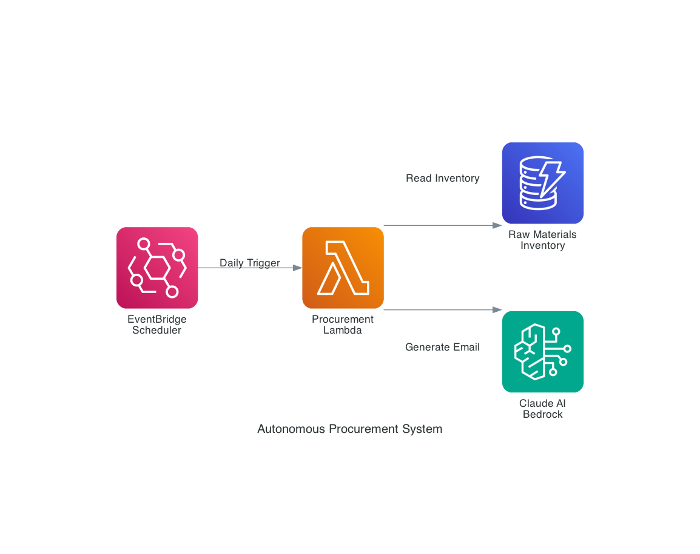
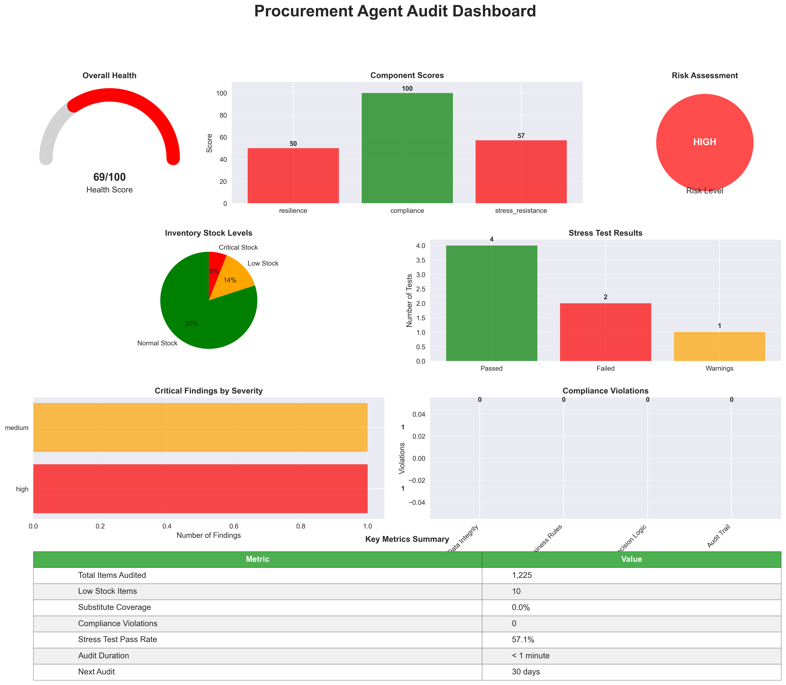

# Autonomous Procurement System

An AI-powered procurement automation system that monitors inventory levels, identifies substitute materials, and generates professional justification emails using AWS Bedrock and Claude AI.

## Architecture



The system consists of:
- **EventBridge Scheduler**: Triggers daily inventory checks
- **Lambda Function**: Core processing logic for inventory analysis and supplier evaluation
- **DynamoDB**: Stores raw materials inventory with technical specifications
- **Bedrock (Claude AI)**: Generates professional procurement emails and recommendations

## Features

- **Automated Inventory Monitoring**: Identifies items with low stock levels (< 5 days)
- **Intelligent Substitute Detection**: Finds alternative suppliers with identical technical specifications
- **AI-Powered Communication**: Generates professional emails highlighting cost savings and supply continuity
- **Technical Specification Matching**: Ensures substitute materials meet exact requirements
- **Cost Optimization**: Identifies significant price differences between suppliers

## Core Components

### 1. Raw Materials Data Generator (`generate_raw_materials.py`)
Creates realistic inventory data with:
- 50 materials with SKU, supplier, price, lead time, and days on hand
- Technical specifications (density, tensile strength, grade)
- 3 pairs of interchangeable parts from different suppliers

**Sample Raw Materials Data:**
```json
[
  {
    "SKU": "SKU-5895-agS",
    "SupplierName": "Baird Ltd",
    "Price": 422.22,
    "LeadTime": 6,
    "DaysOnHand": 12,
    "TechnicalSpecs": {
      "density": 2.7,
      "tensile_strength": 310,
      "grade": "6061-T6"
    }
  },
  {
    "SKU": "SKU-1066-ZeP",
    "SupplierName": "Rangel-Rodriguez",
    "Price": 116.85,
    "LeadTime": 20,
    "DaysOnHand": 16,
    "TechnicalSpecs": {
      "density": 2.7,
      "tensile_strength": 310,
      "grade": "6061-T6"
    }
  },
  {
    "SKU": "SKU-6898-DmY",
    "SupplierName": "Gibson-Middleton",
    "Price": 224.24,
    "LeadTime": 32,
    "DaysOnHand": 1,
    "TechnicalSpecs": {
      "density": 7.02,
      "tensile_strength": 476,
      "grade": "Ps58"
    }
  }
]
```

### 2. Purchase Evaluation Logic (`evaluate_purchase.py`)
Implements approval workflow:
- **REJECTED**: Technical specs don't match
- **APPROVED**: Specs match and price < $1000
- **PENDING MANAGER**: Specs match but price ≥ $1000

### 3. Claude AI Integration (`ask_claude.py`)
Connects to AWS Bedrock for:
- Natural language email generation
- Professional procurement recommendations
- Cost-benefit analysis

### 4. Simulation Engine (`simulation.py`)
Orchestrates the complete workflow:
- Identifies low-stock items
- Searches for suitable substitutes
- Generates and stores justification emails

### 5. Resilience Testing Suite
Comprehensive audit and testing framework:
- **Resilience Auditor** (`resilience_auditor.py`): Tests decision accuracy and substitute availability
- **Compliance Validator** (`compliance_validator.py`): Validates regulatory and business rule adherence
- **Stress Tester** (`stress_tester.py`): Simulates failure scenarios and edge cases
- **Master Auditor** (`master_auditor.py`): Orchestrates all audits and generates comprehensive reports
- **Visual Report Generator** (`visual_report_generator.py`): Creates interactive dashboards and charts
- **HTML Report Generator** (`html_report_generator.py`): Generates web-friendly audit reports

## Example Output

The system generated this procurement recommendation:

```
Subject: Supplier Switch Proposal - SKU-5895-agS

Dear R&D Department,

I would like to propose a supplier switch for the item SKU-5895-agS, currently sourced from Baird Ltd at $422.22 per unit. With only 3 days remaining in our inventory, it is crucial to ensure a continuous supply of this item.

I have identified a suitable substitute, SKU-1066-ZeP from Rangel-Rodriguez, which meets the identical technical specifications of {'density': 2.7, 'tensile_strength': 310, 'grade': '6061-T6'}. Remarkably, the price offered by Rangel-Rodriguez is $116.85 per unit, representing a substantial cost savings of 72.3%.

By switching to Rangel-Rodriguez as our supplier for this item, we can maintain an uninterrupted supply chain while achieving significant cost reductions. I kindly request your prompt consideration of this proposal to ensure a seamless transition and capitalize on the considerable cost savings.

Thank you for your attention to this matter.

Best regards,
Procurement Team
```

## Local Development Setup

### Prerequisites
```bash
pip install faker boto3 diagrams matplotlib seaborn
brew install graphviz  # macOS only
```

### Running the System
```bash
# Generate sample data
python3 generate_raw_materials.py

# Test purchase evaluation
python3 test_evaluate_purchase.py

# Run full simulation
python3 simulation.py

# Generate architecture diagram
python3 arch_diagram.py

# Run comprehensive resilience audit
python3 master_auditor.py

# Generate visual reports
python3 visual_report_generator.py
python3 html_report_generator.py
```

## Resilience Testing & Compliance

The system includes comprehensive audit capabilities to ensure production readiness:

### Audit Components
- **Resilience Testing**: Validates decision accuracy, substitute availability, and system reliability
- **Compliance Validation**: Ensures regulatory adherence and business rule compliance
- **Stress Testing**: Simulates failure scenarios, data corruption, and extreme conditions
- **Visual Reporting**: Generates executive dashboards and interactive reports

### Sample Audit Results
```
Overall Health Score: 69/100
Risk Level: HIGH
Recommendation: Immediate attention required

Component Scores:
  Resilience: 50/100
  Compliance: 100/100
  Stress Resistance: 57/100

Key Findings:
  - 0% substitute coverage for low-stock items
  - 100% specification matching accuracy
  - 2 stress test failures requiring attention
```

### Generated Reports
- `master_audit_report.json`: Comprehensive audit data
- `audit_dashboard.png`: Visual dashboard with charts and gauges
- `audit_report.html`: Interactive web-based report



## AWS Deployment

### Infrastructure Requirements

1. **DynamoDB Table**: `raw-materials-inventory`
   - Partition Key: `SKU` (String)
   - Attributes: `SupplierName`, `Price`, `LeadTime`, `DaysOnHand`, `TechnicalSpecs`

2. **Lambda Function**: `procurement-agent`
   - Runtime: Python 3.9+
   - Memory: 512 MB
   - Timeout: 5 minutes
   - Environment Variables:
     - `DYNAMODB_TABLE`: `raw-materials-inventory`
     - `BEDROCK_MODEL_ID`: `anthropic.claude-3-sonnet-20240229-v1:0`

3. **EventBridge Rule**: `daily-procurement-check`
   - Schedule: `rate(1 day)` or `cron(0 9 * * ? *)` (9 AM daily)
   - Target: Lambda function

4. **IAM Role**: `procurement-lambda-role`
   ```json
   {
     "Version": "2012-10-17",
     "Statement": [
       {
         "Effect": "Allow",
         "Action": [
           "dynamodb:Scan",
           "dynamodb:GetItem",
           "dynamodb:Query"
         ],
         "Resource": "arn:aws:dynamodb:*:*:table/raw-materials-inventory"
       },
       {
         "Effect": "Allow",
         "Action": [
           "bedrock:InvokeModel"
         ],
         "Resource": "arn:aws:bedrock:*::foundation-model/anthropic.claude-3-sonnet-20240229-v1:0"
       },
       {
         "Effect": "Allow",
         "Action": [
           "ses:SendEmail",
           "sns:Publish"
         ],
         "Resource": "*"
       }
     ]
   }
   ```

### Deployment Steps

1. **Create DynamoDB Table**:
   ```bash
   aws dynamodb create-table \
     --table-name raw-materials-inventory \
     --attribute-definitions AttributeName=SKU,AttributeType=S \
     --key-schema AttributeName=SKU,KeyType=HASH \
     --billing-mode PAY_PER_REQUEST
   ```

2. **Load Sample Data**:
   ```python
   import boto3
   import json
   
   dynamodb = boto3.resource('dynamodb')
   table = dynamodb.Table('raw-materials-inventory')
   
   with open('raw_materials.json', 'r') as f:
       materials = json.load(f)
   
   for item in materials:
       table.put_item(Item=item)
   ```

3. **Deploy Lambda Function**:
   - Package the code with dependencies
   - Upload to Lambda with the IAM role
   - Configure environment variables

4. **Create EventBridge Rule**:
   ```bash
   aws events put-rule \
     --name daily-procurement-check \
     --schedule-expression "rate(1 day)"
   
   aws events put-targets \
     --rule daily-procurement-check \
     --targets "Id"="1","Arn"="arn:aws:lambda:region:account:function:procurement-agent"
   ```

### Lambda Function Code Structure

```python
import boto3
import json
from datetime import datetime

def lambda_handler(event, context):
    # Initialize AWS clients
    dynamodb = boto3.resource('dynamodb')
    bedrock = boto3.client('bedrock-runtime')
    
    # Scan for low-stock items
    low_stock_items = scan_inventory_for_low_stock()
    
    # Process each low-stock item
    for item in low_stock_items:
        substitute = find_substitute(item)
        if substitute:
            email = generate_email_with_bedrock(item, substitute)
            send_notification(email)
    
    return {
        'statusCode': 200,
        'body': json.dumps(f'Processed {len(low_stock_items)} items')
    }
```

## Benefits

- **Cost Savings**: Automatically identifies cheaper alternatives (up to 72% savings in examples)
- **Supply Continuity**: Prevents stockouts through proactive monitoring
- **Compliance**: Ensures technical specifications are maintained
- **Efficiency**: Reduces manual procurement research time
- **Scalability**: Handles large inventories with minimal overhead
- **Audit Trail**: Maintains records of all recommendations and decisions
- **Resilience Testing**: Comprehensive audit framework ensures production readiness
- **Visual Reporting**: Executive dashboards provide actionable insights
- **Predictive Compliance**: Identifies issues before they become violations

## Security Considerations

- All AWS resources use least-privilege IAM policies
- Sensitive data encrypted at rest in DynamoDB
- API calls to Bedrock are logged via CloudTrail
- Email notifications can be configured with encryption

## Monitoring & Alerting

- CloudWatch metrics for Lambda execution
- DynamoDB performance monitoring
- Bedrock usage and cost tracking
- SNS notifications for critical inventory levels

This autonomous system transforms procurement from reactive to proactive, ensuring optimal supplier relationships while maintaining technical compliance and cost efficiency.